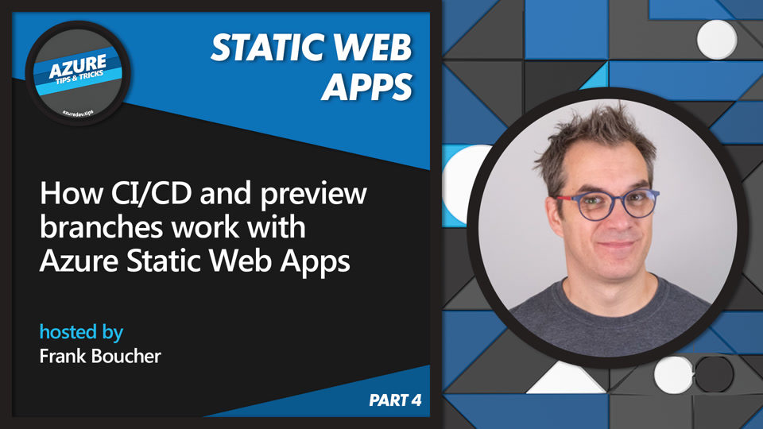

Simple demo
=========== 
Just a simple demo in Azure!

This code is used as demo during videos part of the series [Azure Tips and Tricks: Static Web Apps](https://channel9.msdn.com/Series/Azure-Tips-and-Tricks-Static-Web-Apps) on Microsoft Channel 9.

Azure Static Web Apps is a serverless web app hosting service offering streamlined full-stack development, with a lot of built-in features to make your life easier. We created this series of practical, bite-sized videos with all the tips and tricks you need to get up to speed quickly!

We choose to cover all the basics you need to get started, and then focus on specific use-cases that may be useful in most situations. With these videos, you'll get all the essential knowledge to move your project forward with Azure Static Web Apps!

To complete your learning journey, we also have an interactive course on Microsoft Learn: https://aka.ms/learn/swa

Interactive tutorials on Microsoft Learn: https://aka.ms/Learn/StaticWebApps
Watch the full series: https://aka.ms/StaticWebAppsTipsC9

## Videos about C#

### [How CI/CD and preview branches work with Azure Static Web Apps](https://channel9.msdn.com/Series/Azure-Tips-and-Tricks-Static-Web-Apps/How-to-secure-your-C-API-with-Azure-Static-Web-Apps-13-of-16--Azure-Tips-and-Tricks-Static-Web-Apps)

Learn how the CI/CD workflow works with GitHub Actions and Azure Static Web Apps, and how you can preview your pull requests changes in pre-production environments.

---

### [How to create a web app in C# with Blazor & Azure Static Web Apps](https://channel9.msdn.com/Series/Azure-Tips-and-Tricks-Static-Web-Apps/How-to-create-a-web-app-in-C-with-Blazor--Azure-Static-Web-Apps-11-of-16--Azure-Tips-and-Tricks)
With Blazor you can use C# all the way to create full-stack web apps. Look at this video to build and deploy a complete serverless web app and API entirely written in C# with .Net, Blazor and Azure Static Web Apps.

---

### [How to add a C# API to your Blazor web app](https://channel9.msdn.com/Series/Azure-Tips-and-Tricks-Static-Web-Apps/How-to-add-a-C-API-to-your-Blazor-web-app-12-of-16--Azure-Tips-and-Tricks-Static-Web-Apps)

Now that you built your web app with C# and Blazor, what about adding a serverless C# API to it? Have a look!

---

### [How to secure your C# API with Azure Static Web Apps](https://channel9.msdn.com/Series/Azure-Tips-and-Tricks-Static-Web-Apps/How-to-secure-your-C-API-with-Azure-Static-Web-Apps-13-of-16--Azure-Tips-and-Tricks-Static-Web-Apps)

Prevent unwanted users to access your C# API by configuring authentication and authorization in your Blazor Azure Static Web Apps.

## How to use this code

To deploy or use this code here the steps you will need to do:

1. Copy the code contain in this repo into your GitHub account by using the **Use this template** button.
2. Open the Azure portal (https://portal.azure.com). Create a new Azure Static Web Apps (like explained in the video **How to create a web app in C# with Blazor & Azure Static Web Apps**)
    - When asked the the GitHub repository use the URL to YOUR repository created in step 1.

## Questions & Comments

You can leave you questions and comments in the comment section of each videos. You can also create an [GitHub Issue](https://github.com/FBoucher/AzureStaticWebApp-CSharp-SimpleDemo/issues). 

Your happy, it works... let us know too!